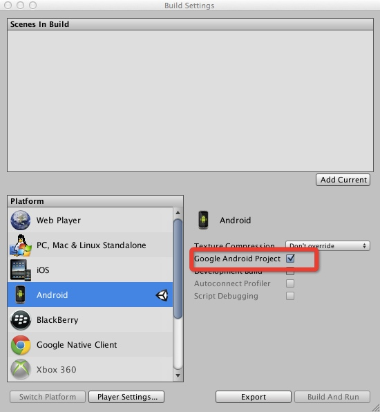

#Unity的接入

## 在Unity中导入Chameleon的资源包
导入之后会添加一个Android的插件

## 导出Android工程
因为Chameleon是基于Library的方式来管理渠道，因此必须要导出Android工程才可以。在Unity中最简单的办法就是导出Google Android Project的方式，如下图



使用这个方式有两点需要注意：

1. 工程没有build.xml，您使用工具生成Chameleon工程之后，可以从chameleon/Resource/unity/build.xml拷贝一份出来
2. 请在这个工程里面设置您的APP ICON，并将icon放入对应分辨率的drawable底下，48\*48的放入res/drawable-mdpi, 72\*72放入res/drawable-hdpi, 96\*96的放入res/drawable-xhdpi


## 修改生成的Main Activity
Chameleon Unity的接口类是 ``` prj.chameleon.platformapi.unity.UnityChannelInterface```

1. 在 UnityPlayerNativeActivity.onCreate中添加 ```UnityChannelInterface.init(this);```
2. 在 UnityPlayerNativeActivity.onPause添加 ```UnityChannelInterface.onPause();```
3. 在 UnityPlayerNativeActivity.onResume添加 ```UnityChannelInterface.onResume();```

## 开始使用接口
Unity的接口也有两个部分，第一个部分是请求接口，第二个部分是回调接口

###请求接口

ChameleonSDK

```
		/**
		 * 用户登录
		 */ 
		public static void login() 
		
		/**
		 * 游客登录
		 */ 
		public static void loginGuest() 
		
		/**
		 * 让游客注册成为渠道正式用户或者绑定一个现有的账户
		 */ 
		public static void registGuest(string tip) 
		
		/**
		 * 充值接口
		 * @param orderId 账单ID
     	 * @param uidInGame 用户在游戏内的ID
     	 * @param userNameInGame  用户在游戏内的昵称
     	 * @param serverId  当前的大区ID
     	 * @param currencyName 货币名称
     	 * @param rate 1元RMB可以购买多少游戏货币
     	 * @param realPayMoney 实际需要支付的钱，单位： 分
     	 * @param allowUserChange 是否允许用户自己输入充值的数量，如果允许，realPayMoney会被忽略
		 */ 
		public static void charge(string orderId, 
		                          string uidInGame,
		                          string userNameInGame,
		                          string serverId,
		                          string currencyName,
		                          int rate,
		                          int realPayMoney,
		                          bool allowUserChange)
		                          
		/**
     	 *  用户购买一个产品
     	 * @param orderId 账单ID
     	 * @param uidInGame 用户在游戏内的ID
     	 * @param userNameInGame 用户在游戏内的昵称
     	 * @param serverId  当前的大区ID
     	 * @param productName 商品名称
     	 * @param productID 商品ID
     	 * @param productCount 商品个数
     	 * @param realPayMoney 实际需要支付的RMB，单位：分
     	*/
		public static void buy(string orderId, 
		                       string uidInGame,
		                       string userNameInGame,
		                       string serverId,
		                       string productName,
		                       string productId,
		                       int productCount,
		                       int realPayMoney)
		                       
		/**
		 * 用户登出
		 */
		public static void logout()
		
		/**
		 * 当前平台是否支持账户切换
		 */ 
		public static bool isSupportSwitchAccount() 

		/**
		 * 切换账户
		 */ 
		public static void switchAccount() 
		
		/**
		 * 创建并且显示工具条
		 * @param position, 创建的位置
		 */ 
		public static void createAndShowToolBar(ToolbarPosition position) 

		/**
		 * 显示或者隐藏工具条
		 * @param visible， 是否显示
		 */ 
		public static void showFloatBar(bool visible)
		
		/**
		 * 销毁工具条
		 */ 
		public static void destroyToolBar() 

		/**
		 * 游戏被切换到后台然后又切回前台之后需要调用这个
		 */ 
		public static void onResume() {
			mBridge.callFunc ("onPause"); 
		}

		/**
		 * 获取防沉迷资料
		 */ 
		public static void antiAddiction() 

		/**
		 * 销毁SDK
		 */ 
		public static void destroy() 
		
		/**
		 * 获取渠道的名称
		 */ 
		public static string getChannelName()

		/**
		 * 注册渠道SDK的事件监听
		 */
		public static void registerListener(ChameleonSDK.EventListener listener)

		/**
		 * 取消注册的事件监听者
		 */ 
		public static void unregisterListener() 
		
		/**
     	* 获取渠道的userid
		* @return 渠道的user id
     	*/
		public static string getUid() {
			return mBridge.callFunc<string>("getUid");
		}
		
		/**
     	* 用户是否登录
     	* @return true 如果用户已经登录
     	*/
		public static bool isLogined() {
			return mBridge.callFunc<bool>("isLogined");
		}
		
		/**
    	 * 获取这次登录的session token
     	* @return 
     	*/
		public static string getToken() {
			return mBridge.callFunc<string>("getToken");
		}
		
		/**
     	* 获取这登录的pay token
     	* @return the pay token of this channel
     	*/
		public static string getPayToken() {
			return mBridge.callFunc<string>("getPayToken");
		}
		
		/**
     	* 将在chameleon鉴权之后的回包传入SDK
     	* @param rsp the login rsp from chameleon server
     	* @return
     	*/
		public static bool onLoginRsp(string rsp) {
			return mBridge.callFunc<bool>("onLoginRsp", rsp);
		}
```

### 回调接口

您需要实现ChameleonSDK.EventListener的接口，用来处理请求的回调或者是渠道SDK主动触发的一些消息。	

```
		public class EventListener {
			/**
			 *  SDK初始化完成
			 */
			public virtual void onInit() {}
			
			/**
			 *  用户完成登陆
			 *  @param loginInfo, 登陆信息，可以直接发给SDK server进行验证
			 */ 
			public virtual void onLogin(string loginInfo) {}
			
			/**
			 *  用户通过游客身份登陆了
			 */ 
			public virtual void onLoginGuest () {}
			
			/**
			 * 用户登陆失败 
			 * @param code, 失败的原因
			 */
			public virtual void onLoginFail(int code) {}
			
			/**
			 * 游客用户尝试绑定了一个真实的渠道账户
			 * @param code, 是否绑定成功 
			 * @param loginInfo, 登陆信息，可以直接发给SDK server进行验证
			 */ 
			public virtual void onRegistGuest(int code, string loginInfo) {}
			
			/**
			 * 用户完成支付了
			 * @param code, 支付是否成功的返回值
			 */
			public virtual void onPay(int code) {}
			
			/**
			 * 从渠道的Pause事件返回
			 */ 
			public virtual void onPause() {}
			
			/**
			 * 拉取了用户的防沉迷信息
			 * @param flag, 成人或者未成年，如果渠道没有这个接口，那么都会返回成年
			 */ 
			public virtual void onAntiAddiction(int flag) {}
			
			/**
			 * 渠道SDK已经销毁了
			 */
			public virtual void onDestroyed() {}
			
			/**
			 * 用户切换账户
			 * @param code, 是否切换成功，如果没有成功，则用户已经登出
			 * @param loginInfo, 登陆信息，可以直接发给SDK server进行验证
			 */ 
			public virtual void onSwitchAccount(int code, string loginInfo) {}
			
			/**
			 * 当用户已经登出了
			 */ 
			public virtual void onLogout(){}
			
			/**
			 * 用户即将要切换账户了，可以在这里做一些保存用户资料的工作
			 */
			public virtual void preAccountSwitch(){}
			/**
			 * 游客用户已经绑定到了一个正式的渠道用户上了
			 * @param loginInfo, 登陆信息，可以直接发给SDK server进行验证
			 */
			public virtual void onGuestBind(string loginInfo){}
		}
```
